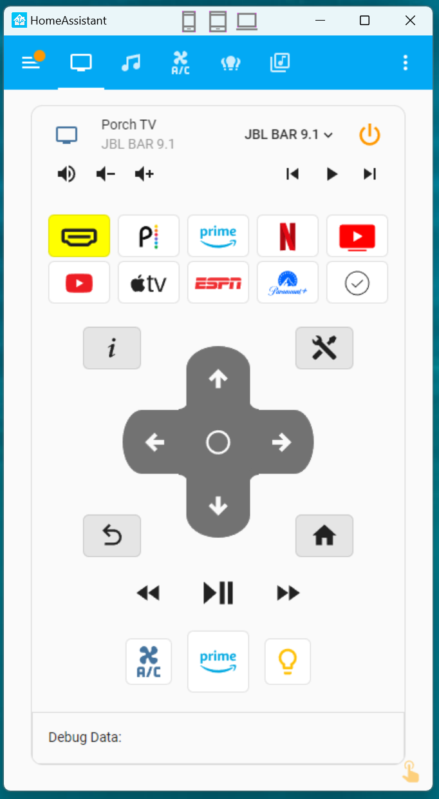

## HomeAssistant Viewer

A super simple Windows 10/11 desktop home assistant viewer app, designed to conserve real estate. I hate having a full browser window just for HA on my desktop, and wanted a simple, phone like window, that I can leave in a corner of my screen.

It's C# and uses Edge as the embedded browser. It doesn't do much. It just loads a web page in a compact shell, with a few resizing presets.
You must edit `settings.json` to include your own HomeAssistant target URL.

The little icons on the title bar, let you switch sizes quickly and you can set your default sizes in `settings.json`.

### **Important**:
This project uses WebView2 (Edge). It cannot be installed into `C:\Program Files\` because of the way WebView2 works. 
You must install it in a writable directory. The default in the included installer is the `C:\ProgramData\HomeAssistant\HA Viewer` directory.

After installation, navigate to that directory and carefully edit the settings.json file.
You will need admin permissions to edit this file (if you installed `HA Viewer`, in the default location). 
Your alternative choice is to install `HA Viewer` somewhere else where windows doesn't get in the way, like `C:\HomeAssistant\HA Viewer`
If I get time, and anyone other than me, actually uses the thing, I'll tidy it up and put the data in the user's appdata folder. But for now, this is it.

Anyway, edit the uri line (see below) to point to your homeassistant dashboard of choice, i.e. `http://homeassistant.local:8123/porch-control`, 
unless you would rather see the default bbc web site!


```
{
  "uri": "https://www.bbc.com/",
  "sizes": {
    "default": {
      "width": 460,
      "height": 820
    },
    "phone": {
      "width": 460,
      "height": 820
    },
    "tablet": {
      "width": 888,
      "height": 820
    },
    "desktop": {
      "width": 920,
      "height": 1280
    }
  }
}
```


Screenshots:  


